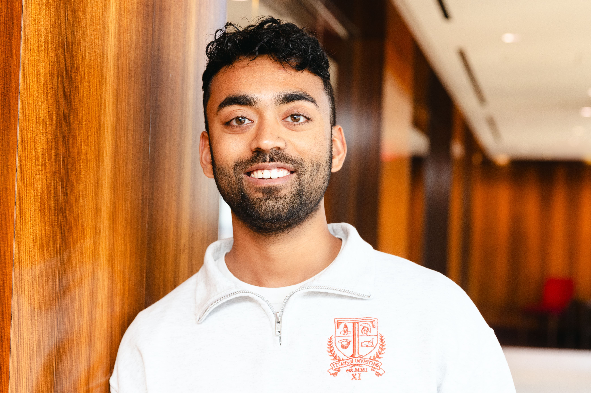

 
 
<a href="https://www.linkedin.com/in/jai-gandhi/" style="color: inherit;" target="_blank"><i class="fa fa-linkedin"></i></a>
<a href="https://www.instagram.com/_jaigandhi/" style="color: inherit;" target="_blank"><i class="fa fa-instagram"></i></a>

- I love team games. I grew up playing team sports, and was on an intense dance team in college.
- Growing up with small-town Indian immigrant parents has given me the privilege of valuing Eastern spirituality and collectivism along with Western creativity and aspiration.
- My suburban childhood was filled with play. I try to approach life with a mindset based on play.
- The best decisions I’ve made have been (1) going to UT Austin from Chicago, (2) moving to Boston post-grad, and (3) studying abroad in Budapest. Each of these decisions involved new  environments with new people, leading to great personal growth. Feeling myself become a better version of myself in these environments has led me to embrace and seek change and discomfort.
- If I could solve one problem, it would be the loneliness epidemic. I value community, and a long term goal of mine is to maximize the quantity of high quality relationships in my life.
- The current version of my entrepreneurial spirit is my pursuit of becoming a respected DJ and gatherer in Boston.
- I am interested in applying the investor’s mindset and processes to philanthropy. I am very involved with the [USIT Foundation](https://www.usitfoundation.org/) and recently joined the [Highwind Impact Fund](https://highwindimpact.wordpress.com/).
- One of my goals this year is to do more long form writing. Follow along [here](https://jaigandhi.substack.com/).